# KKBOX's Churn Prediction Project

## Problem Statement

KKBOX is a music streaming service that mainly targets the markets of Asia. They offer a large and varied music library that contains 
over 30 million tracks. Since the service is working on a freemium basis, it is very crucial for the company to keep its paying
customers from canceling or not paying for their membership. 

Customer churn or customer default is a business problem that all companies have to deal with, and it is very important to have a solution
in place to reduce the churn rate and to also know the reasons behind why customers are leaving. 

Churn for KKBOX's use case is defined as follows:
> A churning customer is a subscribed customer that does not make a new subscription transaction within 30 days after the
> current membership expiration date.

By using different classification models, the goal is to accurately predict at any given month, the customers that will
churn in the next 30 days. The models are trained on previous user behavior calculated at different time windows to provide
the model with patterns and changes in each customer's behavior. 

Since some provided datasets are very large, I had to use other tools more adapted for Big Data to perform transformations and aggregations.
The data consists of time series values, so the temporal aspect of the data must be correctly handled in feature engineering 
and when doing training and cross-validation.

  
<strong>Click to see all columns (measures or features) of the datasets provided </strong>

  <strong>Train Dataset:</strong>

| **Column** | Description                                                                                                                                                                                              |
|:-----------|:---------------------------------------------------------------------------------------------------------------------------------------------------------------------------------------------------------|
| msno       | Unique identifier of the client                                                                                                                                                                          |
 | is_churn   | This is the target variable.  Churn is defined as whether or not a user has subscribed within 30 days of the expiration date. is_churn = 1 means that the client churned, is_churn = 0 means renewal |
 
  <strong>Members Dataset:</strong>

| **Column**             | Description                                  |
|:-----------------------|:---------------------------------------------|
| msno                   | Unique identifier of the client              |
| city                   | city of origin of the client                 |
| bd                     | age of the client                            |
| registered_via         | registration method used                     |
| registration_init_time | date of the first subscription of the client |

  <strong>User logs Dataset:</strong>

| **Column**      | Description                                                     |
|:----------------|:----------------------------------------------------------------|
| msno            | Unique identifier of the client                                 |
| date            | date of aggregation of listening statistics                     |
| num_25          | number of songs played less than 25% of the song length         |
| num_50          | number of songs played between 25% to 50% of of the song length |
| num_75          | number of songs played between 50% to 75% of of the song length |
| num_985         | number of songs played between 75% to 98.5% of the song length  |
| num_100         | number of songs played over 98.5% of the song length            |
| num_unq         | number of unique songs played                                   |
| total_secs      | total seconds played                                            |

  <strong>Transactions Dataset:</strong>

| **Column**             | Description                                                            |
|:-----------------------|:-----------------------------------------------------------------------|
| msno                   | Unique identifier of the client                                        |
| payment_method_id      | payment method used                                                    |
| payment_plan_days      | length of membership plan in days                                      |
| plan_list_price        | listing price in New Taiwan Dollar (NTD)                               |
| actual_amount_paid     | actual amount paid in New Taiwan Dollar (NTD)                          |
| is_auto_renew          | flag if the client has the auto-renew feature ON                       |
| transaction_date       | date of transaction - format %Y%m%d                                    |
| membership_expire_date | Date of expiration of the client's subscription                        |
| is_cancel              | flag (value of 1) if the transaction is a cancel otherwise flag with 0 |

## Introduction
Enclosed in this folder, there can be found my analysis that I did to the real world
data provided by KKBox that contain their client's listening behavior as well as their personal information. I have used
Altair, Seaborn and Matplotlib for generating the graphs. As for the modeling part, I have used the following : **..complete me..**

### Motivation
The use of machine learning and data mining techniques has exploded during the last few years due the fact they enable
the business decisions takers to make wise decisions by taking into consideration the insights generated from them.

Music Streaming providers like KKBox could really benefit from integration data science techniques and generate more 
business value since the data collected from their clients is really informative. 

You can find <a href="https://nbviewer.org/github/achrafaourik/Customer-Retention/blob/master/eda.ipynb">here</a> the Exploratory Data Analysis for generating initial insights in regard to the behavior of churning 
clients and the difference between them and renewing clients.   
The EDA step of the project is very important since it can point us at the right variables that are related to the churn 
rate of the clients.  

I have also made predictive models that are able to accurately predict which clients are more
likely to churn (not renewing their subscription within one month of their subscription's expiry date).  
You can find the notebook of the modeling phase <a href="#">here</a>.

Having access to both EDA and the predictive model is very useful for the company to make intelligent decisions 
about what they should do in order to keep their customers.

### Some Exploratory Data Analysis (Churn Distribution + Features in contrast with Churn)

#### Churn distribution:

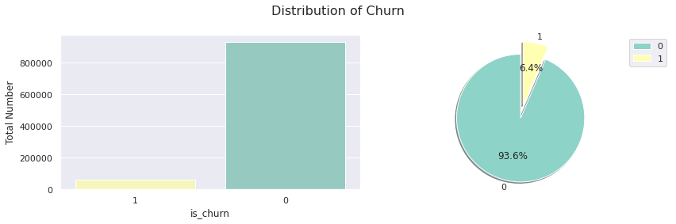

#### Evolution of Churn (in numbers)

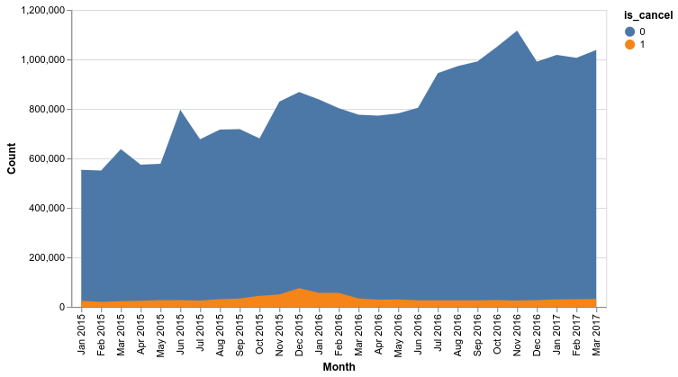

#### Evolution of Churn (in percentage)

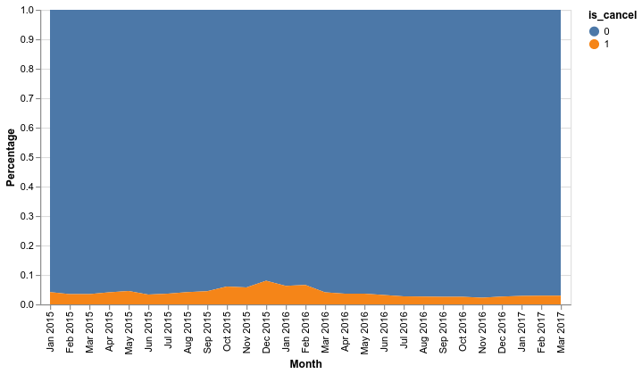

#### By Gender

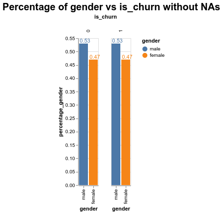

#### By Age

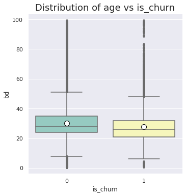

#### By Tenure

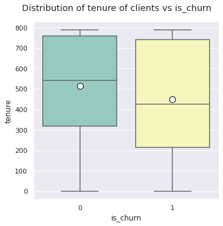

#### By Amount Paid

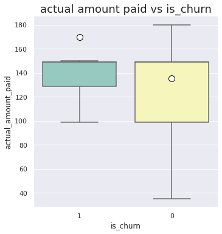

#### By Number of Daily Transactions

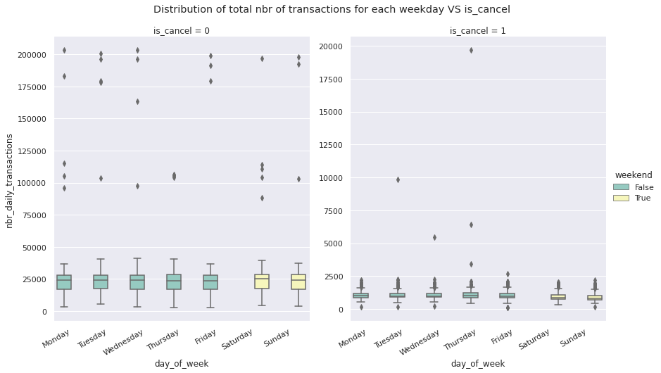

#### By Number of Monthly Transactions

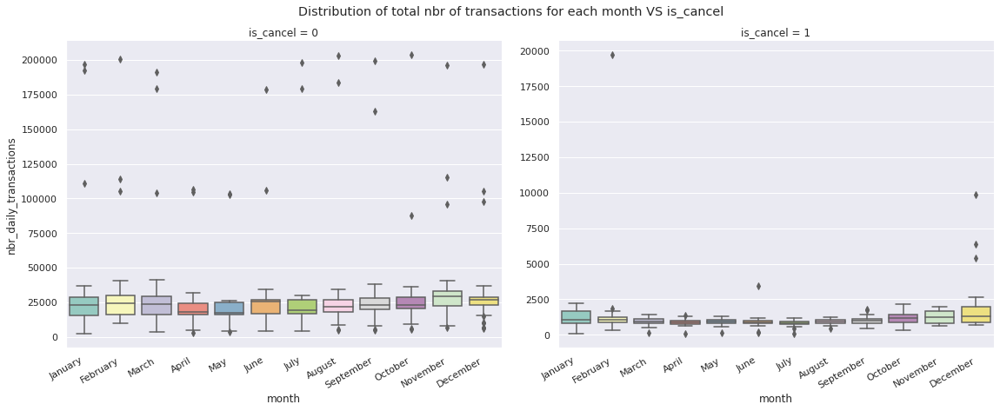

#### By Auto Renew Feature

#### By Payment Method

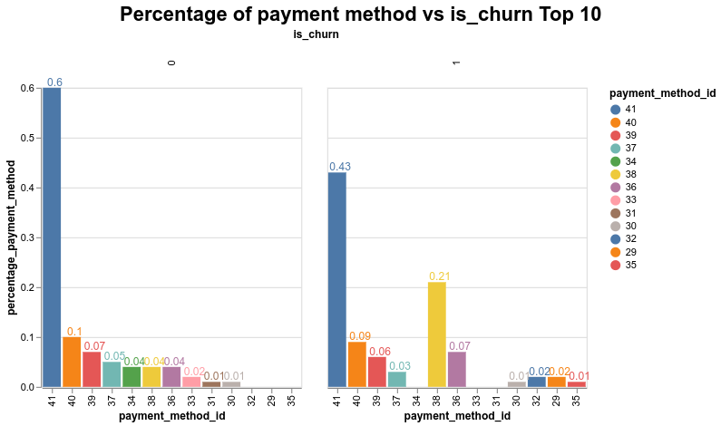

#### By Registration Method

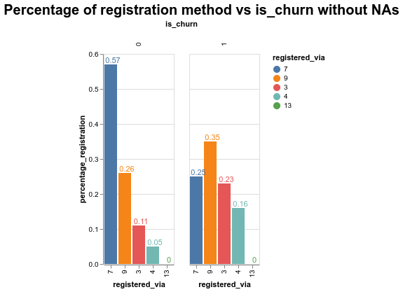

#### By Total Number of unique songs

#### By Total Number of seconds listened

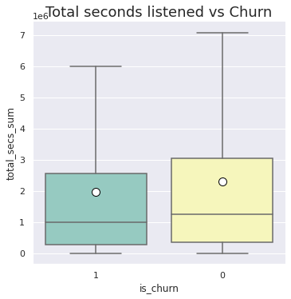

### General insights generated from previous EDA:
- The data is **heavily skewed and *unbalanced***. We can take care of this by  **balancing the classes** using either or combining different of the following methods: **larger weights** for the positive class in the cost function, **under-sampling** the majority class or **over-sampling** the minority class (using **SMOTE** for example). 
- The **distribution of churn in constrast with Gender** is the **same**.
- **The clients that actually churn have are younger compared to the clients that renew their subscription**. This insight is actually quite intuitive since the younger population are more likely to be financially dependent and make less money than the older clients.
- **The new clients are more likely to churn** compared to loyal customers. This means that the company should focus more if its efforts in coming up with incentives to keep the new clients.
- **Clients that follow more expensive plans are more likely to churn**!
- There is **a peak of cancel transactions at Mondays**, the cancels are also the lowest on saturdays and sundays meaning that the clients are **less likely to cancel their memberships on the weekends**.
- **Cancels start to increase towards the end of the year** (starting **from October all the way up to January**) and **flatten throughout the rest of the year**.
- **Clients that don't actually have auto renew feature on are more likely to churn**! The company should focus more of its efforts to keep the clients that don't have the auto renew feature on or convince them to activate it.
- **Churners tend to use the payment method <ins>38</ins> more frequently**.
- **Clients frequently use the registration method "7"** for subscribing while **the churners use the "9" registration method**. 
- **Clients who spend less overall time listening are more likely to churn**!

