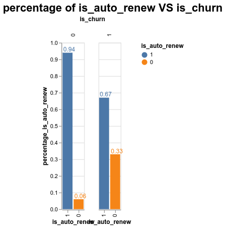
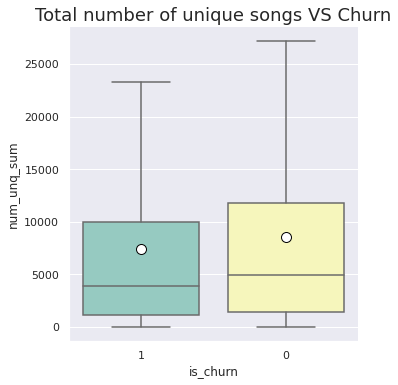

# Churn Prediction Project

## Problem Statement

KKBOX is a music streaming service that mainly targets the markets of Asia. They offer a large and varied music library that contains 
over 30 million tracks. Since the service is working on a freemium basis, it is very crucial for the company to keep its paying
customers from canceling or not paying for their membership. 

Customer churn or customer default is a business problem that all companies have to deal with, and it is very important to have a solution
in place to reduce the churn rate and to also know the reasons behind why customers are leaving. 

Churn for KKBOX's use case is defined as follows:
> A churning customer is a subscribed customer that does not make a new subscription transaction within 30 days after the
> current membership expiration date.

By using different classification models, the goal is to accurately predict at any given month, the customers that will
churn in the next 30 days. The models are trained on previous user behavior calculated at different time windows to provide
the model with patterns and changes in each customer's behavior. 

Since some provided datasets are very large, I had to use other tools more adapted for Big Data to perform transformations and aggregations.
The data consists of time series values, so the temporal aspect of the data must be correctly handled in feature engineering 
and when doing training and cross-validation.

  
<strong>Click to see all columns (measures or features) of the datasets provided </strong>

  <strong>Train Dataset:</strong>

| **Column** | Description                                                                                                                                                                                              |
|:-----------|:---------------------------------------------------------------------------------------------------------------------------------------------------------------------------------------------------------|
| msno       | Unique identifier of the client                                                                                                                                                                          |
 | is_churn   | This is the target variable.  Churn is defined as whether or not a user has subscribed within 30 days of the expiration date. is_churn = 1 means that the client churned, is_churn = 0 means renewal |
 
  <strong>Members Dataset:</strong>

| **Column**             | Description                                  |
|:-----------------------|:---------------------------------------------|
| msno                   | Unique identifier of the client              |
| city                   | city of origin of the client                 |
| bd                     | age of the client                            |
| registered_via         | registration method used                     |
| registration_init_time | date of the first subscription of the client |

  <strong>User logs Dataset:</strong>

| **Column**      | Description                                                     |
|:----------------|:----------------------------------------------------------------|
| msno            | Unique identifier of the client                                 |
| date            | date of aggregation of listening statistics                     |
| num_25          | number of songs played less than 25% of the song length         |
| num_50          | number of songs played between 25% to 50% of of the song length |
| num_75          | number of songs played between 50% to 75% of of the song length |
| num_985         | number of songs played between 75% to 98.5% of the song length  |
| num_100         | number of songs played over 98.5% of the song length            |
| num_unq         | number of unique songs played                                   |
| total_secs      | total seconds played                                            |

  <strong>Transactions Dataset:</strong>

| **Column**             | Description                                                            |
|:-----------------------|:-----------------------------------------------------------------------|
| msno                   | Unique identifier of the client                                        |
| payment_method_id      | payment method used                                                    |
| payment_plan_days      | length of membership plan in days                                      |
| plan_list_price        | listing price in New Taiwan Dollar (NTD)                               |
| actual_amount_paid     | actual amount paid in New Taiwan Dollar (NTD)                          |
| is_auto_renew          | flag if the client has the auto-renew feature ON                       |
| transaction_date       | date of transaction - format %Y%m%d                                    |
| membership_expire_date | Date of expiration of the client's subscription                        |
| is_cancel              | flag (value of 1) if the transaction is a cancel otherwise flag with 0 |

## Introduction
Enclosed in this folder, there can be found my analysis that I did to the real world
data provided by KKBox that contain their client's listening behavior as well as their personal information. I have used
Altair, Seaborn and Matplotlib for generating the graphs. As for the modeling part, I have used the following : **..complete me..**

### Motivation
The use of machine learning and data mining techniques has exploded during the last few years due the fact they enable
the business decisions takers to make wise decisions by taking into consideration the insights generated from them.

Music Streaming providers like KKBox could really benefit from integration data science techniques and generate more 
business value since the data collected from their clients is really informative. 

You can find <a href="https://nbviewer.org/github/achrafaourik/Customer-Retention/blob/master/Exploratory_Data_Analysis_Cleaning.ipynb">here</a> the Exploratory Data Analysis for generating initial insights in regard to the behavior of churning 
clients and the difference between them and renewing clients.   
The EDA step of the project is very important since it can point us at the right variables that are related to the churn 
rate of the clients.  

I have also made predictive models that are able to accurately predict which clients are more
likely to churn (not renewing their subscription within one month of their subscription's expiry date).  
You can find the notebook of the modeling phase <a href="https://nbviewer.org/github/achrafaourik/Customer-Retention/blob/master/Modeling.ipynb">here</a>.

An extra step has been also made, which is the Clustering of the clients (also called Clients Segmentation),
where the goal is to group together clients that have the same profile / behavior.  
The notebook for the Clustering phase can be found <a href="https://nbviewer.jupyter.org/github/achrafaourik/Customer-Retention/blob/master/Clustering.ipynb">here</a>.

Having access to both EDA and the predictive model is very useful for the company to make intelligent decisions 
about what they should do in order to keep their customers.

### Some Exploratory Data Analysis (Churn Distribution + Features in contrast with Churn)

#### Churn distribution:

#### Evolution of Churn (in numbers)

#### Evolution of Churn (in percentage)

#### By Gender

#### By Age

#### By Tenure

#### By Amount Paid

#### By Number of Daily Transactions

#### By Number of Monthly Transactions

#### By Auto Renew Feature

#### By Payment Method

#### By Registration Method

#### By Total Number of unique songs

#### By Total Number of seconds listened

### General insights generated from previous EDA:
- The data is **heavily skewed and *unbalanced***. We can take care of this by  **balancing the classes** using either or combining different of the following methods: **larger weights** for the positive class in the cost function, **under-sampling** the majority class or **over-sampling** the minority class (using **SMOTE** for example). 
- The **distribution of churn in constrast with Gender** is the **same**.
- **The clients that actually churn have are younger compared to the clients that renew their subscription**. This insight is actually quite intuitive since the younger population are more likely to be financially dependent and make less money than the older clients.
- **The new clients are more likely to churn** compared to loyal customers. This means that the company should focus more if its efforts in coming up with incentives to keep the new clients.
- **Clients that follow more expensive plans are more likely to churn**!
- There is **a peak of cancel transactions at Mondays**, the cancels are also the lowest on saturdays and sundays meaning that the clients are **less likely to cancel their memberships on the weekends**.
- **Cancels start to increase towards the end of the year** (starting **from October all the way up to January**) and **flatten throughout the rest of the year**.
- **Clients that don't actually have auto renew feature on are more likely to churn**! The company should focus more of its efforts to keep the clients that don't have the auto renew feature on or convince them to activate it.
- **Churners tend to use the payment method <ins>38</ins> more frequently**.
- **Clients frequently use the registration method "7"** for subscribing while **the churners use the "9" registration method**. 
- **Clients who spend less overall time listening are more likely to churn**!

### Clustering of KKBox's clients
**Clustering** is part of the unsupervised learning with a goal of **grouping together points that
are similar to each other while being different from the other points belonging to the other
groups** (clusters).

This is very useful especially for our use case since we can be able to target a small number
of groups of clients that we know are fairly similar to each other when doing marketing campaigns
which is more practical, efficient and cheaper than to look at each client separately.

After following several approaches to select the appropriate number of clusters
for the KMeans algorithm in this <a href="./Clustering">notebook</a>, I have found
that choosing n_clusters=5 is the best for this use case's dataset.

#### KMeans algorithm centroids ddagunos

**Insights generated from the centroids of the KMeans clustering :**

- Cluster number **5** contains the oldest clients of the database (despite not being old with an average age of **23** years old), these clients have the **most time spent listening** with both the total of seconds listens and the total number of unique songs listened. The **total amount paid for the cluster is very high** (3100 NTD) and close to the highest  among all clusters.
- Cluster number **4** contains the **highest percentage of the clients** (**35%**): they are **the youngest but they are also the ones that spend the least time on the streaming service and also spend the least amount of money**.
- Cluster number **1** contains a third of the clients database, they also have **the highest total amount paid (3258 NTD) and the most days subscribed**.

#### 2D visualization of KMeans clusters using PCA

### Feature Engineering

The step that always follows the loading and cleaning phase is to do **Feature Engineering**.
Feature Engineering is constructing features or variables (inputs for the model) that we think
have high predictive power and will increase the model's performance in predicting the target
variable. 

The features or input variables are obtained by applying multiple transformations, calculations
and aggregations on the raw data. They are created by using multiple `Python` frameworks,
since some datasets provided cannot fit in the computer's memory and have to processed using
different libraries like `vaex` and `dask`.

Optimizations have been made to the code such as parallel computing of features to further reduce
the computation time. So, **the time needed to process all features is divided by the number
of cores at our disposal**.

#### **List of features used:**

  <strong>Features made using the `members` Dataset:</strong>

| **Feature**        | Description                                                       |
|:-------------------|:------------------------------------------------------------------|
| **bd**             | Age of the client (in years)                                      |
| **city**           | One hot encoding of the top 5 most recurring cities               |
| **registered_via** | One hot encoding of the top 5 most recurring registration methods |
| **tenure_days**    | number of days since the client started being a member            |

  <strong>Features made using the `user_logs` Dataset:</strong>

| **Feature**                        | Description                                                                                                                                                                                                                                                                                                                                                                                                                                                                                                                                                                                                                                                                              |
|:-----------------------------------|:-----------------------------------------------------------------------------------------------------------------------------------------------------------------------------------------------------------------------------------------------------------------------------------------------------------------------------------------------------------------------------------------------------------------------------------------------------------------------------------------------------------------------------------------------------------------------------------------------------------------------------------------------------------------------------------------|
| **last_login_days**                | Number of days since last login                                                                                                                                                                                                                                                                                                                                                                                                                                                                                                                                                                                                                                                          |
| **stats_login_monthly**            | Statistics of number of monthly logins:   - **nbr_logins_monthly_mean** : average number of monthly logins	 - **nbr_logins_monthly_max**: max number of monthly logins - **nbr_logins_monthly_min** : minimum number of monthly logins	 - **nbr_logins_monthly_std** : standard deviation of the number of monthly logins - **nbr_logins_monthly_count** : number of months where the used has logged on to the app                                                                                                                                                                                                                                                  |
| **aggregate_user_logs_history**    | Aggregations per client on their history of listening behavior prior to a given date:   - **total_secs_sum** : the total time spent by the user on the streaming service  - **total_secs_mean** : average daily time spent by the user   - **total_secs_std** : standard deviation of the time spent by the user  - **num_unq_sum** : total number of unique songs the client has listened to.   - **num_unq_mean**: average number of unique songs the client has listened to daily.   - **num_unq_std** : the standard deviation of the history of unique songs the client has listened to.   - **msno_count**: number of days the user has used the app.  |
 
  <strong>Features made using the `transactions` Dataset:</strong>

| **Feature**            | Description                                                                                                                                                                                                                                                                                                                                                                                                                                                                                                                                                                                                                                                                                                                                                                                                                                                                                                                                                                                                                                                                            |
|:-----------------------|:---------------------------------------------------------------------------------------------------------------------------------------------------------------------------------------------------------------------------------------------------------------------------------------------------------------------------------------------------------------------------------------------------------------------------------------------------------------------------------------------------------------------------------------------------------------------------------------------------------------------------------------------------------------------------------------------------------------------------------------------------------------------------------------------------------------------------------------------------------------------------------------------------------------------------------------------------------------------------------------------------------------------------------------------------------------------------------------|
| **agg_trx**            | Aggregations of features related to transactions for every client prior to a certain date:   - **actual_amount_paid_sum**: the total amount of money the client has paid in all of their history with the company.  - **actual_amount_paid_mean** : average monthly amount of money paid over their history.  - **actuall_amount_paid_std**: standard deviation of the amount paid monthly.  - **actual_amount_paid_max**: maximum monthly amount paid.  - **actual_amount_paid_min**: minimum monthly amount paid.  - **is_auto_renew_sum**: the total number of months where the client has been using the autorenew feature.  - **is_auto_renew_mean**: (number of months the client has been on autorenew) / (total number of months the client has been subscribed)   - **is_cancel_sum**: the number of cancels the client has done.  - **is_cancel_mean** :  percentage of cancels relative to overall transactions made by the client.   - **msno_count**:  the number of transactions the client has made prior to the relative date. |
| **stats_diff_dates**   | Statistics for the frequency of subscriptions:   - **diff_dates_max**: maximum amount of time the client hasn't made any subscription.   - **diff_dates_min**: minimum amount of time between transactions.   - **diff_dates_mean**: average amount of time between transactions.  - **diff_dates_std**: standard deviation of the amount of time between transactions.                                                                                                                                                                                                                                                                                                                                                                                                                                                                                                                                                                                                                                                                                                |

 <strong>Features made using `churn history`:</strong>

 | **Feature**           | Description                                                                                                                                                                                                           |
|:----------------------|:----------------------------------------------------------------------------------------------------------------------------------------------------------------------------------------------------------------------|
| **stats_churn**       | Aggregations of features related to the churn history:   - **churn_sum**: the total number of times the client has churned before.   - **churn_mean**: percentage of the time the client has churned earlier. |
 
### Modeling
The step following the `Feature Engineering` process, is the `Modeling` phase where the goal is to
create a mathematical model that is capable of generating business value from some given data.

In our use case, the goal is to predict the clients that will churn (clients that will not renew 
their subscription 30 days after their current's subscription's expiry date).

In order to accurately predict churners, or in any machine learning problem, we try to feed the model
with highly predictive variables that contain patterns and correlations associated with the target
variable we try to predict.

The modeling phase will contain multiple steps or iterations where we try at each time to 
improve the model's performance whether by tuning its hyper-parameters : also called
Hyper-Parameter Tuning or by selecting only the features or variables that are actually useful : 
a process that's called Feature Selection. It is also possible to combine the predictions of 
multiple models to create a model that's even more powerful than every one of them.

What follows are the results obtained throughout the whole modeling process (starting from the 
baseline model all the way up to the final model):

We can see from the previous graph, that along the process of the modeling phase, we were able to improve the model's performance (in terms of AUC score) from **65%** all the way up to **85%** which is a **20%%** increase.

We should note that the best improvements to the model came from `Hyper-Parameter Tuning` and `Feature Selection` which have gotten rid of useless features and optimized the initial parameters of the base model.

The `weighted average of the three final models` (**0.4** * *xgb* + **0.4** * *cat* + **0.2** * *rf*) has further improved the machine learning algorithm. 

Also, by **reusing the validation set and adding it to the training set**, it has also improved the model's performance since the model will learn some extra patterns from the additional churning customers instances.

Below are graphs for the feature importance of two of the final models XGBoost and Random Forest :

We can see from both of the plots of the feature importance of XGBoost and CatBoost that the two features `is_auto_renew_sum` and `is_auto_renew_mean`, meaning that these two features have a larger effect on the model when doing predictions.

We have already made this insight from the Exploratory Data Analysis where we found that the clients that don't have the `auto_renew` feature toggled on are most likely to churn.

We can also gather from the Random Forest Feature Importance that the variables `days_last_trx`,
`num_unq_std`, `nbr_logins_monthly_std` contribute the most for its predictions. 
The **number of days since the client has done a subscription**, 
**the standard deviation of the unique songs that client listens to** but also the
**standard deviation of the months when the client has used the streaming platform**  
are all very important for the model.

### Contact Me

| Contact Method     |                                           |
|--------------------|-------------------------------------------|
| Email              | achrafaourik@gmail.com                    |
| LinkedIn           | https://www.linkedin.com/in/achrafaourik/ |
